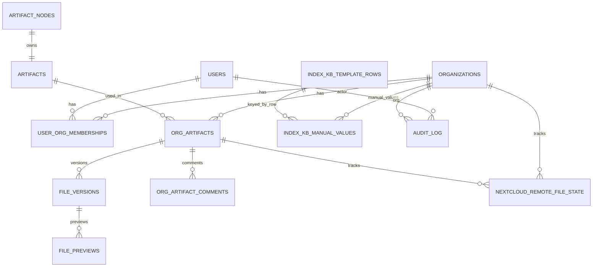

# Медлайн.РТК.КБ — кабинет аудитора/заказчика + админ‑панель (FastAPI + Postgres)

Веб‑приложение для ведения справочника артефактов, загрузки/версий файлов по организациям, комментариев аудитора и отчёта «Индекс КБ». Есть админ‑панель и интеграция с Nextcloud (WebDAV) для автоматического импорта артефактов.

## Содержание
- [Что умеет система](#что-умеет-система)
- [Роли и доступы](#роли-и-доступы)
- [Запуск (Docker)](#запуск-docker)
- [Конфигурация (env)](#конфигурация-env)
- [Основные страницы (UI)](#основные-страницы-ui)
- [Интеграция с Nextcloud](#интеграция-с-nextcloud)
- [Индекс КБ](#индекс-кб)
- [Схема БД (обзор)](#схема-бд-обзор)
- [Схема БД (детально)](#схема-бд-детально)
- [Миграции](#миграции)
- [Диагностика и частые проблемы](#диагностика-и-частые-проблемы)

## Что умеет система
- **Справочник артефактов**: импорт из Excel (лист «Программа») и просмотр.
- **Артефакты организации**:
  - статус **«Загружен/Не загружен»**
  - загрузка файлов (лимит `MAX_UPLOAD_MB`)
  - хранение **версий** файлов (актуальная версия + история для админа)
  - **комментарии аудитора** к артефактам (последний комментарий видит и заказчик).
- **Проводник файлов**: просмотр по структуре папок, построенной из `short_name` (например `ВССТ.КМНК.1 → ВССТ/КМНК/1`).
- **Интеграция Nextcloud (WebDAV)**:
  - настройки подключения в админке
  - тест соединения / поиск организаций (папки) / синхронизация файлов
  - идемпотентность по `etag` + размер файла (не перезаливает неизменённые)
  - создание организаций по папкам (опционально)
  - версионирование при изменении файла в Nextcloud
  - корректная работа с кириллицей в путях (URL‑encoding).
- **Индекс КБ**: генерация/рендер табличного отчёта по эталонному шаблону.
- **Админ‑панель**:
  - организации: создание/редактирование/удаление (с защитой от удаления при связанных данных), “кем создана”
  - пользователи: создание/редактирование, **блокировка**, удаление, фильтр по организации, пагинация/сортировка
  - роли/доступы: назначение ролей пользователям в организациях.

## Роли и доступы
- **admin**
  - полный доступ ко всем страницам
  - видит и может скачивать **историю версий файлов**
  - может удалять текущий файл артефакта (сброс статуса на «Не загружен» и очистка Nextcloud‑состояния, если файл был импортирован).
- **auditor**
  - доступ к аудиту по организациям, добавление комментариев
  - просмотр файлов/проводника
  - **не** видит историю версий (только текущую).
- **customer**
  - доступ к своей организации (в текущем MVP ожидается **ровно одна** организация в membership’ах)
  - видит статус/файл/последний комментарий аудитора (в UI — подсказкой на статусе)
  - загружает/удаляет файл (удаление сбрасывает статус на «Не загружен», история версий сохраняется).

## Запуск (Docker)
Требования:
- Docker Desktop (Linux engine / WSL2)
- свободный порт **8000** (UI)
- свободный порт **5432** (Postgres)

### Дефолтные учётки (dev)
После первого запуска автоматически создаются:
- **admin**: логин/пароль берутся из `docker-compose.yml` (`ADMIN_LOGIN`/`ADMIN_PASSWORD`), по умолчанию `admin / admin12345`
- **auditor**: `auditor / auditor12345`
- **customer**: `customer / customer12345` (привязан к организации **«Демо организация»**, чтобы была доступна в “Индекс КБ”)

### 1) Поднять сервисы
В корне проекта:

```bash
docker compose up -d --build
```

Открыть UI:
- `http://localhost:8000/login`

### 2) Остановить

```bash
docker compose down
```

### 3) Полностью сбросить БД (чистый старт)
Так как Postgres хранит данные в именованном docker volume, чтобы удалить все записи:

```bash
docker compose down -v
docker compose up -d --build
```

## Конфигурация (env)
Основные переменные (см. `env.example` и `docker-compose.yml`):
- **`DATABASE_URL`**: строка подключения SQLAlchemy (по умолчанию Postgres в compose)
- **`APP_SECRET_KEY`**: секрет для подписи JWT
- **`ADMIN_LOGIN`**, **`ADMIN_PASSWORD`**, **`ADMIN_FULL_NAME`**: дефолтный админ (создаётся при старте)
- **`MAX_UPLOAD_MB`**: лимит загрузки файлов

Файлы/тома в `docker-compose.yml`:
- `db_data` (docker volume) → данные Postgres
- `./data/share` → “шара”/локальная папка (MVP‑инструменты миграции/импорта).

## Основные страницы (UI)
### Админ‑панель
- `GET /admin` — главная админ‑страница (плитки)
- `GET /admin/orgs` — организации (с пагинацией/сортировкой, “кем создана”)
- `GET /admin/orgs/{org_id}/users` — пользователи выбранной организации
- `GET /admin/users` — пользователи (создание/редактирование, блокировка/удаление, фильтр по организации)
- `GET /admin/memberships` — роли/доступы (назначение ролей)
- `GET /admin/artifacts` — импорт артефактов (Excel, лист «Программа»)
- `GET /admin/integrations/nextcloud` — Nextcloud интеграция

### Аудитор
- `GET /auditor/artifacts` — аудит (таблица артефактов по организации + комментарии)
- `GET /auditor/files` — проводник файлов
- `GET /auditor/index-kb` — индекс КБ

### Заказчик
- `GET /my/artifacts` — артефакты организации (последний комментарий аудитора виден подсказкой на статусе)
- `GET /my/files` — проводник файлов по структуре `short_name`

## Интеграция с Nextcloud
Страница: `GET /admin/integrations/nextcloud`

### Данные, которые вводит админ
- базовый URL Nextcloud (`https://...`)
- логин/пароль
- корневая папка (откуда начинать синхронизацию)
- флаг “создавать организации”

### Ожидаемая структура папок
```
ROOT/
  <OrgName>/
    ВССТ/
      КМНК/
        1/
          <files...>
```
Соответствие артефакту: `ВССТ.КМНК.1`.

### Идемпотентность и версии
- для каждого удалённого/импортированного файла хранится состояние в `nextcloud_remote_file_state` (remote_path, etag, size)
- при изменении `etag/size` создаётся **новая FileVersion** и она становится текущей
- если файл не изменился — **нет лишних обновлений БД**.

## Индекс КБ
UI:
- `GET /auditor/index-kb` — просмотр/рендер листов отчёта по организации.
Структура форм хранится в БД и заполняется seed‑миграциями Alembic (без парсинга Excel при запуске).

## Схема БД (обзор)
Ниже — “карта” таблиц (упрощённо, без всех индексов):

### Пользователи и доступы
- **`users`**
  - `login`, `password_hash`, `full_name`
  - `is_active` (блокировка входа)
  - `is_admin`
- **`organizations`**
  - `name`
  - `created_at`
  - `created_by_user_id` (кто создал вручную)
  - `created_via` (`manual|nextcloud|system`)
- **`user_org_memberships`**
  - связь user↔org
  - `role`: `admin|auditor|customer`

### Справочник артефактов
- **`artifact_nodes`**: дерево папок/узлов
- **`artifacts`**: артефакт с полями из Excel (topic/domain/short_name/…)

### Артефакты организации и файлы
- **`org_artifacts`**
  - связь org↔artifact
  - `status` (`missing|uploaded`)
  - `current_file_version_id`
  - `updated_at`, `updated_by_user_id`
- **`file_versions`**
  - версии файлов на один `org_artifact`
  - `version_no`, `original_filename`, `sha256`, `size_bytes`
  - хранилище: MVP использует Postgres (`blob`)
- **`org_artifact_comments`**
  - комментарии аудитора по артефактам организации

### Nextcloud
- **`nextcloud_integration_settings`**: параметры подключения (MVP хранит пароль в БД)
- **`nextcloud_remote_file_state`**: состояние удалённого файла для идемпотентности

### Прочее
- **`audit_log`**: аудит‑события (импорт/изменения и т.п.)
- **`stored_files`**: ранняя “упрощённая” модель хранения файлов (исторически).

## Схема БД (детально)
Это “рабочее” описание схемы, чтобы быстрее ориентироваться в данных и интеграциях. Источник истины — модели SQLAlchemy: `backend/app/db/models.py`.

### ER‑диаграмма (основные связи)



### Пользователи и доступы
- **`organizations`**
  - **`id`**: PK
  - **`name`**: уникальное имя организации (видно в UI)
  - **`created_at`**
  - **`created_by_user_id`**: кто создал вручную (nullable)
  - **`created_via`**: `manual|nextcloud|system` (для UI/диагностики)
- **`users`**
  - **`login`**: уникален
  - **`password_hash`**: bcrypt‑хеш
  - **`full_name`**
  - **`is_active`**: блокировка входа
  - **`is_admin`**: глобальный админ
  - **`created_at`**
- **`user_org_memberships`**
  - **`user_id`** → `users.id`
  - **`org_id`** → `organizations.id`
  - **`role`**: `admin|auditor|customer`
  - **`created_at`**
  - уникальность: `(user_id, org_id)`

### Справочник артефактов (референсные данные)
- **`artifact_nodes`**: дерево папок/узлов
  - **`id`**: PK
  - **`parent_id`** → `artifact_nodes.id`
  - **`segment`**: “кусок” пути
  - **`full_path`**: уникальный путь через точки (напр. `Восстановление.Планирование...`)
  - **`sort_order`**
  - **`created_at`**
- **`artifacts`**: один артефакт на один `artifact_nodes`
  - **`id`**: PK
  - **`node_id`** → `artifact_nodes.id` (уникален)
  - **`artifact_key`**: уникальный ключ (nullable)
  - **`topic`**, **`domain`**, **`kb_level`**
  - **`indicator_name`**
  - **`short_name`**: ключ “папочной” структуры в UI/Nextcloud (`ВССТ.КМНК.1`)
  - **`achievement_text`**, **`achievement_item_no`**, **`achievement_item_text`**
  - **`title`**, **`description`**
  - **`created_at`**

### Артефакты организации, файлы и аудит
- **`org_artifacts`**: связь “организация ↔ артефакт”
  - **`org_id`** → `organizations.id`
  - **`artifact_id`** → `artifacts.id`
  - **`status`**: `missing|uploaded`
  - **`current_file_version_id`** → `file_versions.id` (nullable)
  - аудит проверки:
    - **`audited_file_version_id`** → `file_versions.id` (nullable)
    - **`audited_at`** (nullable)
    - **`audited_by_user_id`** → `users.id` (nullable)
  - изменения:
    - **`created_at`**, **`updated_at`**
    - **`updated_by_user_id`** → `users.id` (nullable)
  - уникальность: `(org_id, artifact_id)`
- **`file_versions`**: версии файла по `org_artifact`
  - **`org_artifact_id`** → `org_artifacts.id`
  - **`version_no`**: номер версии (уникален в рамках `org_artifact_id`)
  - **`original_filename`**, **`content_type`**, **`size_bytes`**, **`sha256`**
  - **`storage_backend`**: в MVP `postgres`
  - **`storage_key`**: строковый ключ (nullable, используется для Nextcloud метки)
  - **`blob`**: байты (nullable)
  - **`created_at`**, **`created_by_user_id`** → `users.id` (nullable)
- **`file_previews`**: кеш превью (например, PDF из office)
  - **`file_version_id`** → `file_versions.id` (уникален)
  - **`preview_mime`**, **`preview_size_bytes`**, **`preview_sha256`**, **`preview_blob`**
  - **`last_error`**, **`last_error_at`**
- **`org_artifact_comments`**: комментарии аудитора
  - **`org_id`** → `organizations.id`
  - **`org_artifact_id`** → `org_artifacts.id`
  - **`author_user_id`** → `users.id` (nullable)
  - **`comment_text`**, **`created_at`**
- **`audit_log`**: журнал событий (кто/что/когда поменял)
  - **`at`**, **`actor_user_id`**, **`org_id`**
  - **`action`**, **`entity_type`**, **`entity_id`**
  - **`before_json`**, **`after_json`** (JSONB)
  - **`ip`**, **`user_agent`**

### Nextcloud (WebDAV)
- **`nextcloud_integration_settings`**: текущие настройки интеграции
  - **`is_enabled`**
  - **`base_url`**, **`username`**, **`password`** (MVP: хранится в БД)
  - **`root_folder`**
  - **`create_orgs`**
  - **`last_sync_at`**, **`last_error`**
- **`nextcloud_remote_file_state`**: идемпотентность синхронизации
  - **`org_id`** → `organizations.id`
  - **`org_artifact_id`** → `org_artifacts.id`
  - **`remote_path`**: уникален в рамках организации
  - **`etag`**, **`size_bytes`**
  - **`imported_file_version_id`** → `file_versions.id` (nullable)
  - **`imported_at`**

### Индекс КБ (шаблон в БД + ручные значения)
- **`index_kb_template_rows`**: структура строк по листам (группы/пункты)
  - **`sheet_name`**, **`sort_order`**
  - **`kind`**: `group|item`
  - **`row_key`**: стабильный идентификатор строки
  - **`title`**, **`short_name`**, **`group_code`**
  - уникальность: `(sheet_name, row_key)`
- **`index_kb_manual_values`**: ручные значения (на организацию)
  - **`org_id`** → `organizations.id`
  - **`sheet_name`**, **`row_key`**
  - **`value`** (0..5, может быть дробным)
  - **`updated_at`**, **`updated_by_user_id`** → `users.id` (nullable)
  - уникальность: `(org_id, sheet_name, row_key)`

## Миграции
Используется Alembic. При старте контейнера `backend` автоматически выполняется:

```bash
alembic upgrade head
```

Файлы миграций: `backend/alembic/versions/`.

## Диагностика и частые проблемы
### 1) Не вижу изменения в UI
- сделайте **Ctrl+F5**
- убедитесь, что пересоздан контейнер:

```bash
docker compose up -d --build --force-recreate backend
```

### 2) Порт 8000 занят “левым” процессом
Проверьте кто слушает порт:

```powershell
netstat -ano | findstr :8000
```

### 3) Посмотреть логи backend

```bash
docker compose logs --tail=200 backend
```

### 4) Docker Desktop / context (Windows)
Если `docker compose` пишет про `dockerDesktopLinuxEngine` / `pipe ... cannot find`:
- убедитесь, что запущен Docker Desktop
- проверьте контексты:

```powershell
docker context ls
docker info
```

## Безопасность (MVP‑заметки)
- Пароли пользователей хранятся как `bcrypt`‑хэш (`passlib`).
- Авторизация через **JWT в HttpOnly cookie**.
- Nextcloud пароль в MVP хранится в БД (рекомендуется использовать app‑password и/или секреты/ENV в проде).

