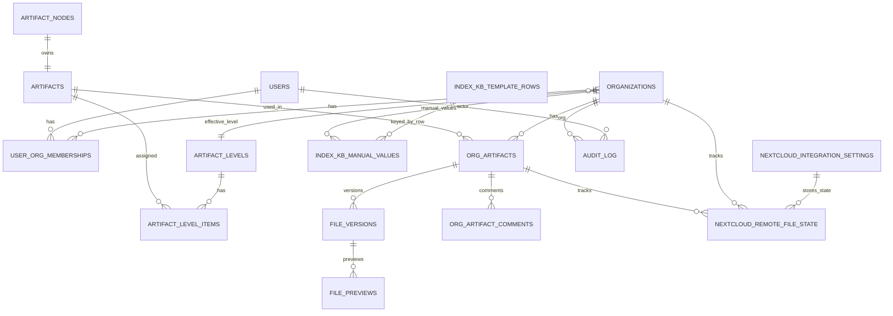

# Приложение Медлайн.РТК.КБ (рабочее название)

Приложение Медлайн.РТК.КБ (рабочее название)

- Основная цель − ведение аудита информационной безопасности.

Основные функции:
- Расчет индекса безопасности
- Справочник артефактов
- Загрузка файлов по организациям
- Версионирование изменений
- Статус и замечания аудита
- Выгрузка офлайн отчетов
- Интеграция с хранилищем (Nextcloud WebDAV)
- Панель управления (админ‑панель)
- Управление ролями
- Дашборды в админ‑панели (Индекс КБ / Статусы / Файлы / Бэклог)
- Индекс КБ по листам «Управление ИБ» и «СЗИ»

## Содержание
- [Что умеет система](#что-умеет-система)
- [Роли и доступы](#роли-и-доступы)
- [Запуск (Docker)](#запуск-docker)
- [Конфигурация (env)](#конфигурация-env)
- [Демо-данные](#демо-данные)
- [Основные страницы (UI)](#основные-страницы-ui)
- [Индекс КБ: расчёт и визуализации](#индекс-кб-расчёт-и-визуализации)
- [Интеграция с Nextcloud](#интеграция-с-nextcloud)
- [Схема БД (обзор)](#схема-бд-обзор)
- [Схема БД (ER + таблицы)](#схема-бд-er--таблицы)
- [Миграции](#миграции)
- [Диагностика и частые проблемы](#диагностика-и-частые-проблемы)

## Что умеет система
### Аудит по артефактам
- **Артефакты организации** (`org_artifacts`):
  - наличие файла (**Нет файла** / **Есть файл**),
  - статус проверки аудитора (`review_status`): **Требует аудита / Проаудировано / Требует корректировки**,
  - “**Изменён** после аудита” (когда загружена новая версия после проверки).
- **Файлы и версии**:
  - хранение **истории версий** (`file_versions`) и текущей версии,
  - у аудитора/заказчика — работа с текущей версией, у админа — доступ к истории.
- **Комментарии аудитора** (`org_artifact_comments`) с отображением последнего комментария.
- **Журнал действий** (`audit_log`) по ключевым изменениям (upload/audit/comment/import и др.).

### Уровни и эффективный набор (L1/L2/L3)
- В системе есть уровни **L1/L2/L3** (`artifact_levels`).
- Бизнес‑смысл: **КБ1 = L1**, **КБ2 = L2**, **КБ3 = L3**.
- Эффективный набор для расчётов — это **объединение артефактов уровней ≤ выбранного** (на базе `artifact_level_items` и `organizations.artifact_level_id`).

### Индекс КБ
- Шаблон отчёта хранится в БД: `index_kb_template_rows` (группы/пункты, разделы).
- По организации можно:
  - смотреть табличный отчёт,
  - вводить ручные значения (если в референсе “нет артефакта”),
  - строить **радар** и другие графики.

### Дашборды (админка)
Страница: `GET /admin/dashboards`.

Доступны графики (в зависимости от выбранного листа УИБ/СЗИ и фильтров):
- **Индекс КБ**:
  - общий индекс (КБ1/КБ2/КБ3),
  - **радар по разделам** (как в шаблоне),
- **Статусы** (по требованиям выбранного листа УИБ/СЗИ):
  - по организациям (стек),
  - по разделам шаблона,
  - срез по тематикам/доменам,
  - по уровням КБ,
- **Файлы**: загрузки по дням,
- **Бэклог**: “сколько дней без результата” (возраст текущей версии для статусов, требующих действий).

### Nextcloud (WebDAV)
- Настройка подключения, тест, синхронизация файлов по структуре каталогов.
- Идемпотентность по `etag` + размеру и версионирование на изменение.

## Роли и доступы
- **admin**
  - полный доступ к админке, импорту, дашбордам,
  - видит историю версий файлов.
- **auditor**
  - аудит артефактов по организациям (комментарии/проверка),
  - просмотр файлов/проводника,
  - индекс КБ,
  - без доступа к админ‑операциям.
- **заказчик** (роль `customer`)
  - доступ к своей организации (в MVP ожидается **ровно одна** организация в membership’ах),
  - загрузка/удаление файлов по артефактам,
  - видит статусы и последний комментарий аудитора.

## Запуск (Docker)
Требования:
- Docker Desktop (Linux engine / WSL2)
- свободные порты: **8000** (UI) и **5432** (Postgres)

### Поднять сервисы
В корне проекта:

```bash
docker compose up -d --build
```

UI: `http://localhost:8000/login`

### Остановить

```bash
docker compose down
```

### Полностью сбросить БД (чистый старт)
Postgres хранит данные в volume `db_data`:

```bash
docker compose down -v
docker compose up -d --build
```

## Конфигурация (env)
Основные переменные (см. `env.example` и `docker-compose.yml`):
- **`DATABASE_URL`**: строка подключения SQLAlchemy
- **`APP_SECRET_KEY`**: секрет для подписи JWT
- **`ADMIN_LOGIN`**, **`ADMIN_PASSWORD`**, **`ADMIN_FULL_NAME`**: дефолтный админ (создаётся при старте)
- **`MAX_UPLOAD_MB`**: лимит загрузки
- **`SEED_DEMO_DATA`**: включить демо‑сид (см. ниже)

Тома в `docker-compose.yml`:
- `db_data` → данные Postgres
- `./data/share` → “шара”/локальная папка (MVP‑инструменты миграции/импорта).

## Демо-данные
### Дефолтные учётки (dev)
Создаются seed‑миграцией `0013_seed_demo_users`:
- **admin**: логин/пароль берутся из `docker-compose.yml` (`ADMIN_LOGIN`/`ADMIN_PASSWORD`), по умолчанию **`admin / admin12345`**
- **auditor**: **`auditor / auditor12345`**
- **Медлайн (заказчик)**: **`medline / medline12345`** (роль `customer`, организация **«Медлайн»**)

Важно: в README используем термин **«заказчик»**, в БД роль называется `customer`.

### Демо-файлы и статусы
Если `SEED_DEMO_DATA=1`, то при применении миграций на **чистой БД** создаются демо‑данные:
- смешанные статусы (pending/approved/needs_correction/changed),
- история версий (v1/v2) для части файлов,
- данные под **Индекс КБ** (включая “Индекс КБ” артефакты для шаблонов и заполненный радар).

Ключевые миграции демо‑сида:
- `0016_seed_demo_all` — демо‑файлы и микс статусов
- `0017_seed_demo_radar_full` — расширение покрытия (для радаров/разделов)
- `0018_seed_kb_artifacts` — создаёт артефакты **под шаблоны Индекса КБ** (иначе радары пустые, т.к. справочник из CSV использует другие `short_name`)

Если включили флаг после того, как БД уже была создана — демо‑сид **не “догонится” автоматически** (это миграции). Делайте `docker compose down -v`.

## Основные страницы (UI)
### Админ
- `GET /admin` — главная (плитки)
- `GET /admin/dashboards` — дашборды (Индекс КБ / Статусы / Файлы / Бэклог)
- `GET /admin/orgs` — организации (по ширине экрана, + столбец “Сотрудников”)
- `GET /admin/orgs/{org_id}/users` — пользователи выбранной организации
- `GET /admin/users` — пользователи (создание/редактирование, блокировка/удаление, фильтры)
- `GET /admin/memberships` — роли/доступы (назначение ролей)
- `GET /admin/artifacts` — импорт справочника артефактов (Excel, лист «Программа»)
- `GET /admin/integrations/nextcloud` — Nextcloud интеграция
- `GET /admin/audit-log` — журнал событий (аудит)

### Аудитор
- `GET /auditor/artifacts` — аудит (таблица артефактов по организации + комментарии)
- `GET /auditor/files` — проводник файлов
- `GET /auditor/index-kb` — индекс КБ (УИБ/СЗИ)

### Заказчик
- `GET /my/artifacts` — артефакты своей организации (статус/файл/последний комментарий)
- `GET /my/files` — проводник файлов по структуре `short_name`

## Индекс КБ: расчёт и визуализации
### Что такое КБ1/КБ2/КБ3
В расчётах это **уровни L1/L2/L3**:
- **КБ1 → L1**
- **КБ2 → L2**
- **КБ3 → L3**

### Авто‑расчёт (упрощённое правило MVP)
Для каждой строки шаблона (по `short_name`) значение считается как:
- **5**, если для артефактов с таким `short_name` в эффективном наборе есть файл и он **проаудирован** (audited==current и review_status=approved),
- **0**, если файл есть, но не проаудирован,
- **None**, если на данном уровне **нет** артефактов (n/a).

Если задан диапазон дат:
- берётся “последняя версия файла в диапазоне”,
- и она считается 5 только если аудит (approved) тоже попадает в диапазон.

### Радар/Разделы
Радар строится по разделам шаблона (`group_code`) и отражает средние значения по пунктам раздела.

## Интеграция с Nextcloud
Страница: `GET /admin/integrations/nextcloud`

### Ожидаемая структура папок
```
ROOT/
  <OrgName>/
    ВССТ/
      КМНК/
        1/
          <files...>
```
Соответствие артефакту: `ВССТ.КМНК.1`.

### Идемпотентность и версии
- Состояние удалённого файла хранится в `nextcloud_remote_file_state` (remote_path, etag, size)
- При изменении `etag/size` создаётся новая `file_versions` и становится текущей
- Если файл не изменился — нет лишних обновлений в БД

## Схема БД (обзор)
Ключевые сущности:
- **users / organizations / user_org_memberships** — пользователи, организации, роли
- **artifact_nodes / artifacts** — справочник артефактов
- **artifact_levels / artifact_level_items** — уровни L1/L2/L3 и состав “дельт” уровней
- **org_artifacts / file_versions / org_artifact_comments** — заполнение по организациям, файлы, комментарии
- **index_kb_template_rows / index_kb_manual_values** — шаблон Индекса КБ и ручные значения
- **nextcloud_integration_settings / nextcloud_remote_file_state** — синхронизация Nextcloud
- **audit_log** — журнал событий

## Схема БД (ER + таблицы)
Источник истины по полям/индексам: `backend/app/db/models.py`.

### ER‑диаграмма (основные связи)



### Таблицы (кратко)
#### `organizations`
- `created_via`: `manual|nextcloud|system`
- `artifact_level_id`: выбранный уровень L1/L2/L3 для “текущего” расчёта

#### `user_org_memberships`
- связь user↔org, роль: `admin|auditor|customer`

#### `artifact_levels`, `artifact_level_items`
- `artifact_levels` — L1/L2/L3 (порядок важен)
- `artifact_level_items` — “дельта” уровня (эффективный набор = union уровней ≤ текущего)

#### `org_artifacts`
- `status`: `missing|uploaded` (наличие файла)
- `review_status`: `pending|approved|needs_correction` (статус проверки)
- аудитные поля: `audited_file_version_id`, `audited_at`, `audited_by_user_id`
- “изменён после аудита” вычисляется как `current_file_version_id != audited_file_version_id` при наличии audited

#### `file_versions`
- версии файлов (Postgres blob в MVP), `version_no` уникален в рамках `org_artifact_id`

#### `index_kb_template_rows`, `index_kb_manual_values`
- шаблон Индекса КБ (группы/пункты по листам) и ручные значения (0..5)

Примечание: “Индекс КБ” артефакты — это обычные `artifacts` с `artifact_key` вида `IKB:<sheet>:<row_key>` (создаются демо‑миграцией `0018_seed_kb_artifacts`).

## Миграции
Используется Alembic. При старте контейнера `backend` выполняется:

```bash
alembic upgrade head
```

Файлы: `backend/alembic/versions/`.

## Диагностика и частые проблемы
### Не вижу изменения в UI
- Сделайте **Ctrl+F5**
- Пересоберите backend:

```bash
docker compose up -d --build --force-recreate backend
```

### Порт 8000 занят

```powershell
netstat -ano | findstr :8000
```

### Логи backend

```bash
docker compose logs --tail=200 backend
```

### Docker Desktop / context (Windows)
Если `docker compose` ругается на контекст/pipe:

```powershell
docker context ls
docker info
```

## Безопасность (MVP‑заметки)
- Пароли хранятся как `bcrypt`‑хэш (`passlib`).
- Авторизация через **JWT в HttpOnly cookie**.
- Nextcloud пароль в MVP хранится в БД (рекомендуется app‑password и/или секреты/ENV в проде).

## Быстрый старт: сброс Docker и запуск “с нуля” (с проверкой миграций)
### Полный сброс проекта в Docker (контейнеры + сеть + volume БД + локальные образы)
Команды выполняются **в корне проекта**.

**Вариант А (рекомендуется):** максимально “чистый старт” именно этого проекта.

```bash
docker compose down -v --remove-orphans --rmi local
docker builder prune -f
docker compose up -d --build
```

- `-v` удаляет volume БД (`db_data`) ⇒ БД будет **пустая**, все миграции пройдут заново.
- `--rmi local` удаляет **локальные** образы, собранные `docker compose build` для этого проекта (например, backend).
- `docker builder prune -f` чистит build‑cache (ускоряет отладку “а точно пересобралось?”).

**Вариант Б (оставить образы, но пересоздать БД):**

```bash
docker compose down -v --remove-orphans
docker compose up -d --build
```

**Важно:** команды `docker image prune -a` / `docker system prune -a` чистят **весь Docker на машине**, не только этот проект.

### Проверка, что миграции применились
Проверяем логи backend и версию Alembic в Postgres:

```bash
docker compose logs --tail=200 backend
docker compose exec -T db psql -U app -d app -c "select version_num from alembic_version;"
```

Ожидаемо (на текущем состоянии репозитория): **`0027_org_audit_period`**.

### Что создаётся демо‑миграциями (SEED_DEMO_DATA=1)
Флаг демо‑сида задаётся в `docker-compose.yml` переменной `SEED_DEMO_DATA`.

#### Организации (organizations)
Создаются миграциями (на **чистой** БД):
- `0013_seed_demo_users`: **`РТК`** (служебная; ранее `Default`) и **`Медлайн`**.
- `0021_seed_medline2`: **`Медлайн 2`** (в дальнейшем переименуется).
- `0023_seed_more_orgs_artifacts`: переименует **`Медлайн 2` → `Макомнет`** (если новое имя свободно) и создаст ещё 8 организаций.

Итого демо‑набор (обычно **ID 2..11**, `РТК` — **ID 1**):
- **2**: Медлайн
- **3**: Макомнет
- **4**: Мортон
- **5**: Твинго
- **6**: Глобус
- **7**: Джиэнси
- **8**: Центральный телеграф
- **9**: Розничные системы
- **10**: Цифровое телевидение
- **11**: Центр хранения данных

#### Пользователи (users)
Миграция `0013_seed_demo_users` создаёт демо‑учётки:
- **admin**: логин/пароль берутся из `docker-compose.yml` (`ADMIN_LOGIN`/`ADMIN_PASSWORD`), по умолчанию `admin / admin12345`
- **auditor**: `auditor / auditor12345`
- **заказчик Медлайн** (роль `customer`): `medline / medline12345`

#### Файлы/версии/статусы (org_artifacts + file_versions)
Демо‑сид старается сделать UI/дашборды “живыми”: есть **файлы**, **история версий**, **смешанные статусы**.

- **`review_status`** (проверка аудитора): `pending` (Требует аудита), `approved` (Проаудировано), `needs_correction` (Требует корректировки)
- **“Изменён”**: это состояние, когда загружена новая версия после аудита (т.е. `current_file_version_id != audited_file_version_id` при наличии audited)

**Медлайн (org_id=2), базовый сид `0016_seed_demo_all`:**
- гарантирует **150** загруженных артефактов (на чистой БД) и микс статусов:
  - **60** `pending`
  - **52** `approved`
  - **22** `needs_correction`
  - **16** “changed” (сначала audited v1, затем загружена v2 ⇒ снова `pending`)
- добавляет историю версий для наглядности:
  - `pending`: у **12** артефактов появляется **v2** (остаётся `pending`)
  - `approved`: у **12** артефактов появляется **v2** (после v2 аудит сброшен ⇒ `pending`)
  - `needs_correction`: у **6** артефактов появляется **v2** (после возврата на корректировку ⇒ `pending`)
- дополнительно делает “upload+audit” для первых **25** пунктов листа **УИБ** и первых **25** пунктов листа **СЗИ** (по `short_name`), чтобы индекс/радар были заметнее.

**Проводник файлов (префиксы ВССТ/МНТ/НС/РЕАГ), сид `0019_seed_medline_folders`:**
- добавляет демонстрационные файлы для Медлайна по префиксам (верхний сегмент `short_name`):
  - **ВССТ: 24**
  - **МНТ: 41**
  - **НС: 82**
  - **РЕАГ: 45**
- для каждого префикса делает детерминированный микс статусов (примерно 55% approved / 25% pending / 15% needs_correction / 5% changed).

**Макомнет (ex‑Медлайн 2) и мульти‑орг демо, сид `0021_seed_medline2`:**
- создаёт “вторую” организацию для сравнения на дашбордах и заливает **150** загрузок (в основном Index‑KB артефакты):
  - **56** `approved`
  - **55** `pending`
  - **24** `needs_correction`
  - **15** “changed” (v2 после аудита)

**Остальные демо‑организации, сид `0023_seed_more_orgs_artifacts`:**
- для каждой новой организации создаёт около **60** загрузок (40 по Index‑KB и 20 по “проводниковым” префиксам) со статус‑миксом:
  - примерно 40% `approved`, 35% `pending`, 15% `needs_correction`, 10% “changed”

**Усиление “разброса” для дашбордов, сид `0024_seed_dash_variance`:**
- для каждой демо‑организации добавляет **минимум ~220** новых версий (в приоритете Index‑KB), с org‑специфичным (но детерминированным) распределением статусов.

#### Целевые значения и “Период аудита”
- `0025_org_kb_targets`: задаёт **целевые значения индекса** (отдельно для листов УИБ/СЗИ) для демо‑организаций.
- `0027_org_audit_period`: добавляет в `organizations` поля `audit_period_start` и `audit_period_weeks` и засевает демо‑периоды для org **2..11** (используются на дашбордах, например “Файлы · По дням”).

#### Демо под “Бэклог · В работе”
Миграция `0026_seed_backlog_sla_demo` (только Медлайн, лист УИБ) **откатывает даты назад** (idempotent), чтобы появились элементы в корзинах давности:
- для `pending` (требует действий) — сдвигает `file_versions.created_at` на **5 / 20 / 45 дней** для части записей
- для `needs_correction` — сдвигает `org_artifacts.audited_at` на **10 / 35 дней** для части записей

### Дашборды (админка): что показывают и зачем
Страница: `GET /admin/dashboards`.

- **Обзор** (только когда выбрана ровно 1 организация): “мини‑панель” из 4 карточек, быстрый вход в детальные дашборды.
- **Индекс КБ**: ключевые метрики КБ1/КБ2/КБ3 и разрезы по листам **УИБ/СЗИ** (включая радар по разделам).
- **Статусы**: распределение состояний по требованиям (в том числе группировка “Сейчас в работе”: `pending / needs_correction / changed`).
- **Файлы**:
  - **По дням**: динамика загрузок; может рисовать **полупрозрачную область “Период аудита”** для выбранной организации
  - **Количество загрузок**: артефакты с \(N\) и более версиями (порог задаётся в фильтре), кликом можно перейти к версиям
- **Бэклог**:
  - **В работе**: сколько элементов “зависло” в статусах, требующих действий, по корзинам давности
  - **Давность**: дополнительный разрез по возрасту/задержке (для оперативного контроля)

